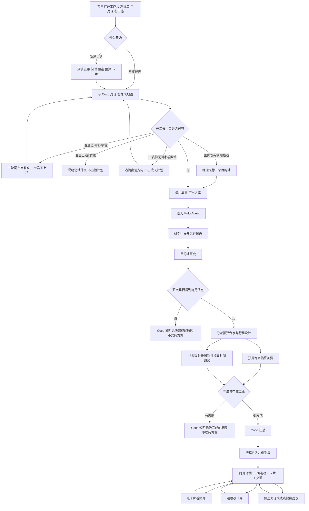
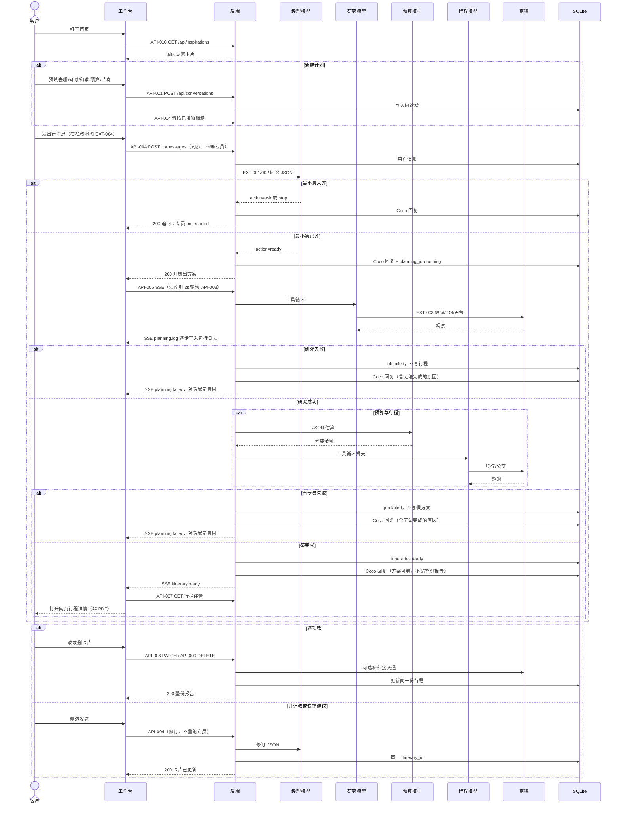

# Xtrip
status: Confirmed

工程目录与仓库 ID 仍为 `Travel_Helper`；客户看到的产品名称是 **Xtrip**。

## 用户目标与完整流程

客户是个人、家庭、情侣或亲子出行者。当前要规划一次旅行时，通常自己查攻略、估花费、排日程；本产品对外是一家旅行公司：客户只对接规划经理 **Coco**（界面上的回复都以此名称显示）。Coco 先通过多轮对话把需求收敛到能出方案，再在公司内分派专员，汇总成一份可改的旅行计划。

第一期是面向展示的 **Multi-Agent Demo**：打开即用，**不做登录**。只做 **旅行前出报告**（问诊 → 专员出可改行程）。旅行中记账/收据/改行程、旅行后日记与社区分享放到第二期，见文末「后续想法」，本期不验收。

规划师问诊依据（D-001 已确认）：专业定制顾问先用人数、天数/月份、进出城市、目的地方向和预算判断「这趟能不能这样走」，不要求客人先交完整行程（[奥利定制行程](https://aolitravel.com/custom-travel/)，2026-09-13）。国内旅行社定制表把目的地和出发地点当必填，并分开国内/出境入口（[康辉私人定制](https://www.kanghui100.com/phone/customize/)，2026-09-13）。护照号属于签证申请阶段，不是第一份推荐路线的前提。本项目第一期不做订票与代办签证。

完整例子：客户在上海，对 Coco 说「带老婆去杭州玩 5 天，预算 2 万，不要太赶」。

1. Coco 从对话中收齐开工最小集：出发地、国内或出境、时长、和谁、预算、节奏 + 模糊描述（此处已有杭州，视为国内）。未齐则追问，**专员不上场**。最多 2 轮追问；客户也可在最小集已齐时说「先按现在这样出一版」。
2. 最小集齐了之后，才进入 Multi-Agent：
   - **目的地研究**：查地点、开放时间、天气、是否适合该人群。
   - **预算专家**：按行程估花费，对照预算口径与上限。
   - **行程设计**：按天数、节奏和研究成果排每日行程，并负责点位之间的时间与路线是否排得下（第一期不单设「数据分析与计算」专员）。
3. Coco 汇总，交给客户一份可改方案：按天行程、预算、地图、行前清单。未说的交通、住宿等按假设写入方案（默认市内公交+适量步行）。
4. 客户进入该行程详情：顶部可按日期切换；上下滚动列表时当前日期跟着变。每天是地点/景点（可含推荐住宿）卡片，卡片之间写明推荐交通和大约耗时。可逐张改，点进卡片看简介；也可在侧边用自然语言对 Coco 说要改什么。不做旅行账单、支出金额、相册。

工作台（D-002 已确认，信息结构参考竞品三栏，不复制其品牌）：规划还没开始时，左菜单、中对话、**右栏为目的地灵感**（国内城市照片 + 图下城市名与推荐理由，吸引想出门；点卡片不进详情）。一旦开始对话，右侧改为地图。客户也可点「新建计划」，用去哪/何时/和谁/预算/**节奏**预填，缩小最小集后再继续和经理聊。

专员工作过程对客户可见，形式为对话里一块可展开的 **Agent 运行日志**（类似 Cursor 的工具步骤列表，不复制其品牌）：默认收起只看摘要，展开看到逐步动作；点其中有结果的步骤，用弹窗看细节。客户始终只对接 Coco，不分别给三个专员下指令。

国内：可以没有精确城市，只有画面时由经理推荐一个目的地再出计划。出境问诊规则仍见 D-001，**本期 Demo 与必验用例全部走国内**，不演示出境行程。

## 本次范围

本次交付：

- To-C Web 工作台：左菜单、中对话、右栏（规划前为目的地灵感卡片，对话开始后为地图）。
- 左侧第一期：对话、行程列表、新建计划。
- 新建计划表单可预填去哪、何时、和谁、预算、**节奏**（轻松 / 适中 / 紧凑），用于缩小最小集，不代替与 Coco 的对话。
- 出行节奏三档：**轻松**、**适中**、**紧凑**。客户说「不要太赶」「自由探索」视为轻松；「快速」「打卡」「特种兵」视为紧凑。
- 内部角色：规划经理（界面显示名 **Coco**）先问诊；最小集齐了之后才调度目的地研究、预算专家、行程设计。
- 行程详情是规划好的报告：按日期切换与滚动同步；每天卡片含地点、景点（可含推荐住宿），卡片之间展示怎么去；可逐项改，也可侧边对话改，并提供高频修改快捷建议。点卡片看简介级微详情，不订票、不记支出。
- 国内可按模糊描述推荐目的地并出计划。本期必验与演示行程均为国内城市。
- 规划过程中客户能看到 Coco 分派与专员完成情况，以及可展开的运行日志（点步骤可看细节）。研究或专员失败时，Coco 必须说明无法完成的原因。
- 本期可用能力：DeepSeek、通义千问、高德地图 API（选型细节留给技术方案）。

非目标：

- 单独的「数据分析与计算」专员（时间与路线计算并入行程设计，金额计算并入预算专家）。
- 旅行公司员工接单后台、多账号权限、顾问协作办公。
- 登录账号、下载/导出、支付订票、签证办理、收集护照号。
- 把整份旅行报告做成 PDF 或其它文件下载；也不把按天卡片、预算、清单整份贴进对话气泡。
- 探索发现的可点进详情、灵感信息流、预订机酒、行程媒体库、日历订阅、邀请同行、发票（竞品有、本期不做）。首页右栏的目的地灵感卡片（图+文、不可点进）除外，见 REQ-005。
- 穿衣建议作为独立能力。
- 实时机票/酒店库存预订。
- 第一期多城串联、客户改某景点后自动重跑三名专员。
- **本期不演示、不作为必验：** 出境行程（含「想出国」追问出按天计划）。问诊分流规则可留在 D-001，第二期或补验时再用。
- **旅行中、旅行后能力**（见「后续想法」）：行程中记花销、上传收据、识别已订酒店、途中改计划；旅行后写日记、发帖、分享到社区或分享经验。本期不验收、不预留空页面冒充已做。

约束：第一期无登录、打开即用；刷新后当前对话与行程还在（本机这份 Demo 数据），不承诺换浏览器/换设备同步。最小集未齐时不进入 Multi-Agent；可有多份行程出现在左侧列表。本期验收用例只用国内目的地。字段细则见 `docs/decisions.md` D-001；页面架构见 D-002；Demo 边界见 D-004；模型与地图见 D-005。

## 需求与验收

### REQ-001 规划经理多轮对话收敛需求

- 用户结果与主流程：客户与规划经理 **Coco** 对话。Coco 吃进已说内容，缺最小集则追问，齐了则告知可以出方案并进入专员规划。专员在收敛完成前不上场。
- 业务规则、权限、数据归属与状态（适用时）：
  - 开工最小集：出发城市、国内或出境（可从目的地推断）、时长、和谁（人数+人群）、预算（数字或档位）、节奏（轻松 / 适中 / 紧凑）+ 旅行模糊描述。
  - 国内：模糊描述且无城市时，经理可推荐一个目的地并视为最小集已齐。
  - 出境：目的地至少到国家或明确区域；仅「想出国」不算齐。
  - 追问最多 2 轮（不含客户第一句话）；一轮问完当前缺口，不拆成每字段一轮。
  - 亲子或提到小孩时，儿童年龄段未齐则在追问里补上，否则最小集不算齐。
  - 第一期不收集护照号；出境只在后来的清单里提示证件。
- 业务前置条件：无。
- AC-001：前置条件：客户打开产品。操作：说明从上海出发、带配偶去杭州 5 天、预算 2 万、不要太赶。可观察结果：Coco 判定最小集已齐，进入分派专员，不再追问国内还是出境。验证方式：该对话后专员状态变为进行中。
- AC-002：前置条件：客户只说「想出去玩」。操作：等待经理回复。可观察结果：经理追问缺口（至少包含出发地或国内/出境、时长、和谁等仍缺项），三个专员均未开始。验证方式：过程视图中专员为未执行。
- AC-009：前置条件：客户说从北京出发、带小孩、想看海、4 天、预算 8 千、别太赶，未点城市。操作：等待经理处理。可观察结果：经理推荐一个国内目的地并进入出计划（专员启动），而不是要求客户先点选城市才能继续。验证方式：方案或过程中出现被推荐的目的地名称，且专员已启动。
- AC-010：本期不验收（出境）。原规则：仅说想出国且无国家/区域时追问、专员不上场。待出境演示时再验。
- AC-011：前置条件：已追问 2 轮，仍缺少出发地或时长。操作：再看经理是否出方案。可观察结果：说明还缺什么，不出假装完整的旅行计划，专员不上场。验证方式：无按天方案。

### REQ-002 规划经理分派专员并汇总

- 用户结果与主流程：最小集齐了之后，Coco 分派目的地研究、预算专家、行程设计，收齐后汇总成一份方案交给客户。
- 业务规则、权限、数据归属与状态（适用时）：客户只对接 Coco。三个专员不直接对客户说话。行程设计负责时间与路线是否排得下；预算专家负责金额。过程中客户能看到各专员状态，以及一块可展开的运行日志：摘要行（如「规划中 · 已查 6 处地点」）点开后列出逐步动作（查地点、读天气、思考、算公交等，用客人能懂的中文，不展示模型品牌或密钥）。有结果的步骤可点，弹窗显示该步细节（查到了哪些点、天气摘要、路线耗时等）；思考类步骤若有正文也可点开。不能把整份按天方案贴进日志。某专员失败时，Coco 必须说明**无法完成的具体原因**，不能只说「失败了」，也不能假装方案已完成。未交代的交通偏好按「公交+适量步行」写入方案并标明是假设。
- 业务前置条件：REQ-001 最小集已齐，或客户在最小集已齐时要求先出一版。
- AC-003：前置条件：AC-001 的咨询已齐最小集。操作：等待规划完成。可观察结果：能看到 Coco 以及三名专员的分派与完成情况；对话里出现可展开的运行日志，展开后至少能看到多条逐步动作；最终由 Coco 汇总出一份方案。验证方式：对照过程视图与最终方案。
- AC-024：前置条件：规划正在进行或刚完成。操作：展开运行日志，再点击一条带结果的步骤（例如搜索景点或查询公交）。可观察结果：弹出该步细节（中文说明 + 结果摘要），不是空白、不含密钥；关闭弹窗后仍停在对话。验证方式：点开再关闭，记录仍在日志里。
- AC-004：前置条件：目的地研究无法完成（如地名无法在国内检索到可用信息）。操作：规划进行到研究失败。可观察结果：对话里出现 **Coco** 的回复，明确说明无法完成**以及原因**（例如找不到该目的地、检索无结果、地图服务不可用等真实原因，不编造）；日志里该失败步骤可点开看到对应失败细节；没有一份假装完整的方案。验证方式：用无法研究的目的地走失败路径，核对回复含原因。

### REQ-003 交付可改的行程、预算、地图与行前清单

- 用户结果与主流程：规划完成后，客户打开**行程详情页**看报告（网页上的按天卡片、预算、地图、行前清单），不是 PDF，也不是把整份方案只写在对话里。可逐项改卡片，也可在侧边对话改。第一期改当天景点或顺序不自动重跑专员。
- 业务规则、权限、数据归属与状态（适用时）：
  - 行程按天列出，顶部有日期切换；列表上下滚动时，当前日期与列表对齐。
  - 每一天包含地点与景点卡片，卡片之间展示推荐交通方式及大约距离/时间（本期用高德，国内）。
  - 点卡片打开简介级微详情（名称、图片、短介绍、地址），可在地图上对应到该点。可含推荐住宿卡片，**不展示支出、不代订**。
  - 可切到地图模式看当天点位。
  - 预算给出分类或合计，并写明口径；有上限且超支时能看出超支。
  - 行前清单列出与本次行程相关的待办（如证件、季节衣物）。本期国内清单不提示护照签证。
  - 不做旅行账单、收据、相册。
- 业务前置条件：规划经理已汇总成功。
- AC-005：前置条件：5 天情侣杭州咨询已汇总成功。操作：打开该行程详情。可观察结果：同时有按天卡片、预算、地图或地图入口、行前清单；有日期切换；行程为 5 天；地图点能对上当天地点。验证方式：核对是否同一趟旅行。
- AC-006：前置条件：方案已展示。操作：客户改某一张景点卡片（例如换时间或删掉该点）。可观察结果：该天卡片更新；专员不因这次逐项改自动重新跑一轮。验证方式：改一处后看卡片与专员状态。
- AC-007：前置条件：客户给了预算上限且估算会超过。操作：查看汇总方案。可观察结果：预算区域标明超出上限。验证方式：用明显偏低的上限跑一次。

### REQ-004 人群与节奏约束规划结果

- 用户结果与主流程：同样目的地和天数，不同人群或节奏会得到不同排法，而不是同一份模板换标题。
- 业务规则、权限、数据归属与状态（适用时）：亲子行程应避开明显不适合儿童的安排或给出说明。节奏三档（调研见 D-006）：轻松每天大约 1–2 个主要点、适中大约 2–3 个、紧凑大约 3–4 个；不验收精确分钟和精确个数，以客户能看出疏密差异为准。客户口语映射：不要太赶 / 自由探索 → 轻松；一般 → 适中；快速 / 打卡 / 特种兵 → 紧凑。
- 业务前置条件：REQ-001 最小集已齐且规划成功。
- AC-008：前置条件：同一目的地、同一天数。操作：一次亲子 + 轻松，一次情侣 + 紧凑。可观察结果：两份行程在疏密或活动类型上可区分。验证方式：并排对照。

### REQ-005 三栏工作台与新建计划预填

- 用户结果与主流程：打开产品即看到左菜单、中对话、右栏目的地灵感（图片 + 图下城市名与推荐理由）。开始与 Coco 对话后，右栏改为地图。点新建计划可预填去哪、何时、和谁、预算、节奏，缩小后再继续对话；表单填不齐也不强制立刻出方案。
- 业务规则、权限、数据归属与状态（适用时）：左侧第一期为对话、行程、新建计划。预填字段写入 Coco 已理解的最小集，缺的仍由对话追问。无登录。行程出现在左侧列表，可再点进详情。刷新不丢本机这份数据，不按账号隔离。灵感卡片为国内目的地占位，有图有短文案；点击不打开目的地详情、不自动开聊、不生成行程。
- 业务前置条件：无。
- AC-012：前置条件：尚无进行中的对话。操作：打开首页。可观察结果：左侧为菜单，中间可聊天，右侧为至少一张目的地灵感卡片（可见图片、城市名和推荐理由，文字不叠在照片上），右栏不是地图。验证方式：对照三栏与卡片内容。
- AC-020：前置条件：首页灵感卡片已展示。操作：点击其中一张卡片。可观察结果：不进入目的地详情页，也不因此开始一份新行程。验证方式：点击后仍停留在首页工作台。
- AC-013：前置条件：客户在中间发出第一条出行消息。操作：发送后查看右栏。可观察结果：右栏变为地图。验证方式：发消息前后截对比。
- AC-014：前置条件：客户打开新建计划。操作：预填去哪=杭州、何时=5 天、和谁=2 名成人、预算=2 万、节奏=轻松，创建后进入对话。可观察结果：Coco 已掌握这些字段，只追问仍缺的最小集（如出发城市），不会把已填的节奏再问一遍。验证方式：看 Coco 第一轮追问是否避开已填项。
- AC-015：前置条件：至少已生成一份行程。操作：打开左侧行程。可观察结果：能看到该行程入口并可点进详情。验证方式：从列表进入详情后仍是同一份方案。

### REQ-006 行程详情：按天卡片逐项改与对话改

- 用户结果与主流程：点进已规划行程后，看到规划报告。顶部按日期切换；上下滚动时当前日期自动跟上。每一天有地点和景点卡片，卡片之间有推荐交通；可在功能层逐张改；点卡片看简介。侧边保留与 Coco 的对话，可用自然语言改；打开详情时展示若干高频修改快捷建议，点选或自己发出一句后建议收起。
- 业务规则、权限、数据归属与状态（适用时）：逐项改和对话改都改当前这份报告，结果一致。点卡片只打开微详情，不进入预订或账单。对话改某张卡片后列表同步。快捷建议点选等于把该原文作为用户消息发给 Coco，随后整组建议消失。换目的地或大幅改天数：本期提示去新建计划。
- 业务前置条件：该行程已有汇总方案。
- AC-016：前置条件：5 天杭州行程已生成。操作：打开详情。可观察结果：按天列出卡片，每天能看到位置和景点；顶部能看到各天日期。验证方式：抽查第 1 天和第 5 天卡片。
- AC-021：前置条件：详情已打开且行程超过 1 天。操作：向下滚动到后一天的内容，或点顶部另一个日期。可观察结果：当前日期高亮与可见内容是同一天；滚动切天与点日期切天都能用。验证方式：从第 1 天滚到第 3 天，看日期高亮是否变为第 3 天。
- AC-022：前置条件：某天至少有连续两张地点卡片。操作：查看两张卡片之间。可观察结果：能看到推荐交通方式及大约距离或时间，不是只有两个地点名硬接。验证方式：对照该间隔文案。
- AC-023：前置条件：详情已打开。操作：点开一张景点卡片。可观察结果：出现该点的简介级说明（至少有名称和一段介绍或地址），没有支付/支出金额；关闭后回到当天列表。验证方式：打开再关闭。
- AC-017：前置条件：详情已打开。操作：在第 2 天删除一张景点卡片。可观察结果：第 2 天不再显示该点；地图若已有该点则不再当作当天行程点。验证方式：卡片与地图对照。
- AC-018：前置条件：详情已打开。操作：在侧边对话对 Coco 说「第三天不要排那么满」。可观察结果：第三天卡片变少或变松，且与逐项改走的是同一份方案。验证方式：对照第三天改前改后。
- AC-019：前置条件：详情已打开且侧边仍显示快捷建议。操作：点击一条高频修改快捷建议。可观察结果：该条文案作为用户消息发给 Coco，其余建议立即消失，方案随之更新。验证方式：点建议后对话里出现该句，建议区收起，卡片变化，不必再手打整句。

## 流程图与时序图

### 用户流程图

关联 REQ-001～REQ-006、AC-001～AC-023。D-001、D-002、D-006。

### 核心交互时序图

技术时序，接口字段以 `docs/tech-spec.md` 为准。关联 REQ-001、REQ-002、REQ-005、REQ-006。角色所用模型见 D-007（已确认 A）。

## 界面约定

有界面。信息结构参考竞品三栏工作台，不复制其品牌、配色与详情页模块。第一期页面：

- **首页 / 新对话**：左菜单、中与 **Coco** 聊天、右栏为国内目的地灵感（照片 + 图下城市名与推荐理由，激发想出门；文字不叠在照片上，避免看不清）。发出第一条出行消息后，右栏改为地图。灵感卡片本期不可点进详情。对话气泡显示名称为 Coco。产品名 **Xtrip** 出现在左侧。
- **左侧菜单**：对话、行程、新建计划。不做探索频道、可点进的灵感详情、预订、发票。
- **新建计划**：弹层预填去哪、何时（天数或月份/灵活日期）、和谁（成人/儿童人数）、预算、节奏（轻松 / 适中 / 紧凑）；可附一句「目前已知的计划」。提交后进入对话，已填项算进最小集。
- **行程详情**：主体是规划报告，在**网页行程详情页**展示，不是 PDF，也不是对话里的一篇长文。顶部日期可点选；上下滚动时日期高亮跟着当天走。每天地点/景点卡片，卡片之间展示推荐交通与大约耗时；可逐张改。点卡片看简介（景点或推荐住宿），可切地图模式看点位。侧边继续找 Coco 对话改，并给高频修改快捷建议。预算、行前清单在同一份报告里。不做账单支出、相册、外部必须跳转导航 App、导出文件。
- **规划过程**：仍在对话区可见 Coco。规划开始后，Coco 消息下方出现可展开的 Agent 运行日志（摘要 + 逐步动作）；点有结果的步骤弹窗看细节。客户不给专员下指令。研究或专员失败时，Coco 必须说出无法完成的原因。方案完成后，Coco 在对话里告知可以查看行程，并给出进入详情的入口；按天内容在详情页阅读和修改。日志在方案完成后仍可展开回看。
- **行程列表**：已生成的行程可从左侧进入。
- **失败与未齐说明**：在对话里说明，不跳空白页冒充成功。

视觉取值见 `docs/ui-style.md`（本轮 Draft）：深夜深黑工作台 + 角落暖光；灵感卡 / 行程卡 / 输入条保留 Border Glow。信息结构仍是三栏，不复制参考站品牌。原型：`docs/prototypes/index.html`。

## 待确认事项

无。用户 2026-09-13 确认整份 PRD；同日补充 Coco、失败须说明原因（D-008）、模型分工 A（D-007）、报告为网页行程详情、产品名 **Xtrip** 与黑白工作台风格（D-009）、规划过程展示可展开运行日志并可点开细节（D-010）。节奏三档见 D-006。

## 后续想法（第二期，本期不验收）

产品按旅行阶段拆：本期只做**旅行前出报告**。下面是已记下、明确不做的延伸，避免以后误当成第一期需求。

**旅行中**

- 对照已做好的规划，记录实际花销，看预算还剩多少。
- 上传收据。
- 识别客户已订的酒店（从收据或订单信息里认出来）。
- 根据行程中的变化，帮忙改计划。

**旅行后**

- 根据旅行中的记录写总结 / 日记。
- 发帖（Post）。
- 分享到社区，或把经验分享给别人。

界面上若以后要入口，再单独立项；第一期左侧不放「旅行中」「社区」占位导航。

